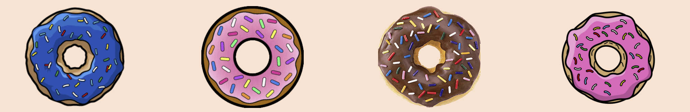

# Sprinkle Collector

This is a "Simpson's" theme game that generates a random number that is given to the user. There are 4 donuts that are each given randomly generated numbers that the user does not know. The user must click on each donut and accumulate points to match the random number they were given. A match is a win, if the user goes over, that's a loss.

## Getting Started

* To visit the deployed site follow this link: [Sprinkle Collector](https://yumnakhtar.github.io/SprinkleCollector/)

* You can also run a git pull command on your terminal and run the application from your computer. This way you can make changes to the code. To view the game you just have to right click the html file and Display in a browser of your choice.

## Built using

* HTML
* JAVASCRIPT
* CSS
* JQUERY
* BOOTSTRAP

## Sole Contributor
Yumna Akhtar - *Initial Work* - [Github](https://github.com/yumnakhtar)

## License

This project is licensed under the MIT License - see the [LICENSE.md](LICENSE.md) file for details

## Acknowledgments
A huge thank you to my intrsuctor and TA's for the help and support as well as W3Schools and Stack Overflow for helping me through each hurdle. 